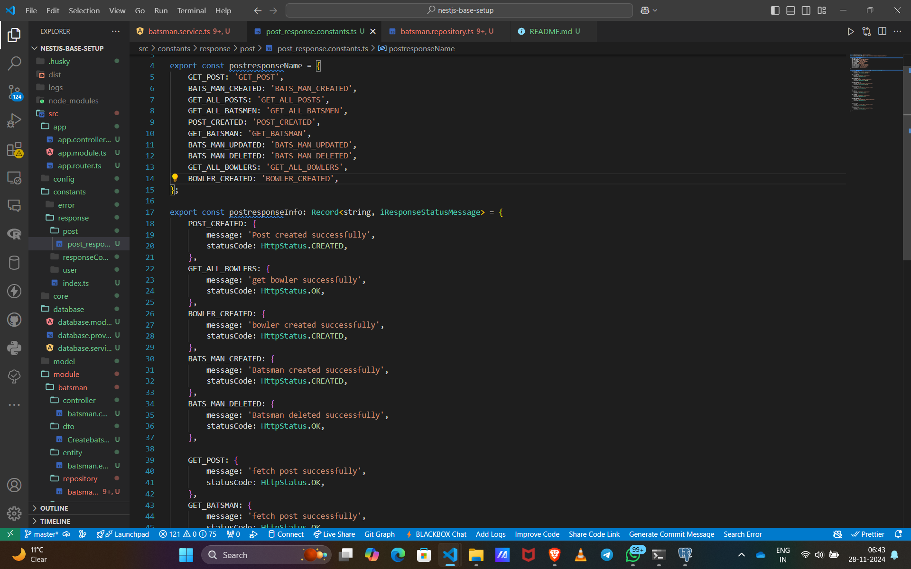
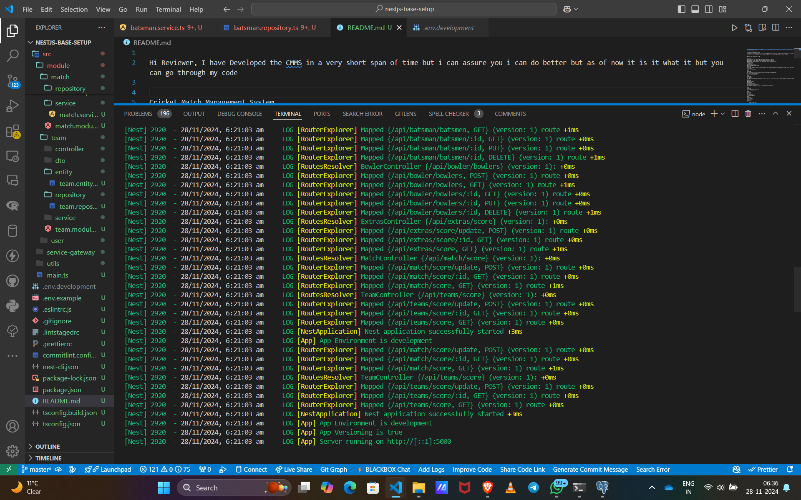

# Cricket Match Management System

# Hi Reviewer, I have Developed the CMMS in a very short span of time but i can assure you i can do better but as of now it is it what is but you can go through my code Quality once before judging me inside the src ->module->here are all code have a look at it .I can do better but i need some little guidance.I am really interested to work with you guys and I would really appreciate a positive response from your side and one more thing i have proper implemented errors and response messages and status code just have a look

This project provides a backend service for managing cricket matches. It supports CRUD operations for entities like Batsman, Bowler, Team, and Match. The API is built using NestJS and uses Sequelize for interacting with a PostgreSQL database.

# I have used Postman for an API 

Features
Manage Batsmen: Add, update, get, and delete batsmen for matches.
Manage Bowlers: Add, update, get, and delete bowlers for matches.
Manage Match Scores: Update match scores and fetch match details.
Manage Teams: Associate teams with matches and manage match statistics.
Project Setup
Prerequisites
Node.js (v16 or above)
NestJS Framework
Sequelize ORM with PostgreSQL
TypeScript
PostgreSQL Database (or any other SQL database that Sequelize supports)it also support mongodb and my sql just pass the configuration in .env
Installation
Clone the repository:

 you can checkout api in the above image this read me is generated by ai so sorry if any mistake 

bash
Copy code
git clone https://github.com/yourusername/cricket-match-management.git
cd cricket-match-management
Install the dependencies:

bash
Copy code
npm install
Configure the environment variables: Create a .env file in the root directory and define your PostgreSQL credentials:

makefile
Copy code
DB_HOST=localhost
DB_PORT=5432
DB_USER=your_db_user
DB_PASSWORD=your_db_password
DB_NAME=your_db_name
Run database migrations (if you're using Sequelize migrations):

bash
Copy code
npx sequelize-cli db:migrate
Start the application:

bash
Copy code
npm start
API Endpoints
Batsman Endpoints
1. Create a Batsman
bash
Copy code
POST /batsmen
Request Body:
json
Copy code
{
    "name": "John Doe",
    "teamId": "team123",
    "runs": 50,
    "wickets": 1
}
2. Get All Batsmen
bash
Copy code
GET /batsmen
3. Get a Batsman by ID
bash
Copy code
GET /batsmen/:id
4. Update a Batsman
bash
Copy code
PUT /batsmen/:id
Request Body:
json
Copy code
{
    "runs": 60
}
5. Delete a Batsman
bash
Copy code
DELETE /batsmen/:id
Bowler Endpoints
1. Create a Bowler
bash
Copy code
POST /bowlers
Request Body:
json
Copy code
{
    "name": "James Anderson",
    "teamId": "team123",
    "wickets": 4
}
2. Get All Bowlers
bash
Copy code
GET /bowlers
3. Get a Bowler by ID
bash
Copy code
GET /bowlers/:id
4. Update a Bowler
bash
Copy code
PUT /bowlers/:id
Request Body:
json
Copy code
{
    "wickets": 5
}
5. Delete a Bowler
bash
Copy code
DELETE /bowlers/:id
Match Endpoints
1. Create a Match
bash
Copy code
POST /matches
Request Body:
json
Copy code
{
    "name": "Match 1",
    "startDate": "2024-11-28T10:00:00Z",
    "status": "in-progress"
}
2. Get All Matches
bash
Copy code
GET /matches
3. Get a Match by ID
bash
Copy code
GET /matches/:id
4. Update Match Score
bash
Copy code
POST /score/update
Request Body:
json
Copy code
{
    "matchId": "match123",
    "runs": 100,
    "wickets": 5
}
5. Update Match Score by ID
bash
Copy code
GET /score/:id
Models
MatchEntity
id: Primary key, unique identifier for the match.
name: Match name/description.
startDate: The date and time when the match starts.
status: Current status of the match (e.g., "in-progress", "completed").
totalRuns: Total runs scored during the match.
totalWickets: Total wickets taken during the match.
matchStats: JSON object containing additional match statistics.
TeamEntity
id: Unique identifier for the team.
name: Name of the team.
captain: Name of the team's captain.
totalRuns: Total runs scored by the team.
totalWickets: Total wickets taken by the team.
totalExtras: Total extras awarded to the team.
Batsman, Bowler
These models represent individual player performances such as runs and wickets.

MatchTeams (Junction Table)
matchId: Foreign key to the match.
teamId: Foreign key to the team.